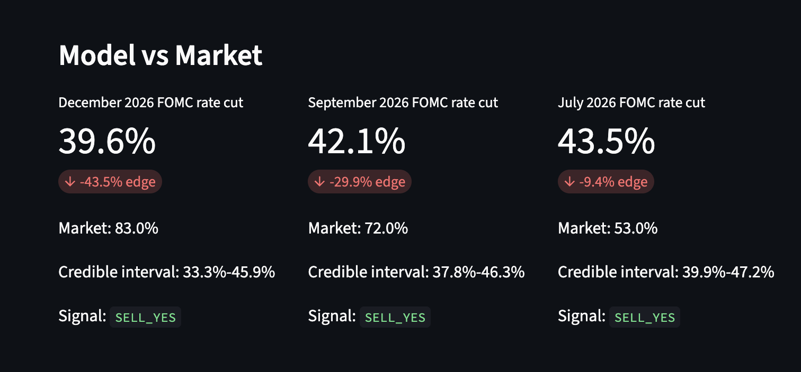

# EventLab

EventLab is a Bayesian pricing engine for prediction-market contracts, focused on Fed rate-cut markets. It estimates a transparent fair probability, compares it with Kalshi/Polymarket-style market prices, and ranks contracts by expected edge.



Example output:

```text
Contract: Will the Fed cut rates at the September FOMC meeting?
Model probability: 64.1%
Credible interval: 57.8%-70.0%
Market probability: 72.0%
Edge: -7.9%
Conclusion: YES appears expensive unless new information explains the gap.
```

## Project Highlights

- Real research-platform layout with separate ingestion, storage, feature engineering, modeling, backtesting, and dashboard layers.
- Hybrid data mode: public BLS macro ingestion plus public prediction-market ingestion attempts, with deterministic fallback data for reproducible demos.
- PostgreSQL schema for production storage plus SQLite output for local demos.
- Bayesian-style posterior sampling with credible intervals and interpretable macro/futures-style evidence.
- Backtest metrics: hit rate, average edge, Brier score, log loss, calibration bins, and simple hypothetical PnL.
- Streamlit dashboard with pricing, source-status tracking, mispricing scanner, calibration, and research-methodology tabs.
- Honest data provenance: every run writes `data/processed/data_sources.csv` so the dashboard shows which sources were live and which used fallback data.

## Quickstart

Run the standard-library pipeline:

```sh
cd eventlab
PYTHONPATH=src python3 -m eventlab.scripts.run_pipeline
```

Run the upgraded hybrid live pipeline:

```sh
cd eventlab
PYTHONPATH=src python3 -m eventlab.scripts.run_pipeline --live
```

Hybrid live mode attempts public Polymarket market ingestion and BLS unemployment/CPI ingestion. If no current Fed-rate contracts are found, or a public source fails, the pipeline falls back to bundled seed data and records that in `data/processed/data_sources.csv`.

Outputs are written to:

- `data/processed/eventlab.sqlite`
- `data/processed/data_sources.csv`
- `data/processed/model_predictions.csv`
- `data/processed/backtest_summary.csv`
- `data/processed/calibration_curve.csv`

Run tests:

```sh
cd eventlab
PYTHONPATH=src python3 -m unittest discover -s tests
```

Optional dashboard:

```sh
cd eventlab
python3 -m pip install -r requirements.txt
PYTHONPATH=src streamlit run src/eventlab/dashboard/streamlit_app.py
```

Optional PostgreSQL:

```sh
cd eventlab
docker compose up -d postgres
```

## Architecture

```text
Kalshi / Polymarket prices
        +
External features
(CPI, unemployment, Fed funds futures, FOMC tone)
        |
        v
PostgreSQL or SQLite
        |
        v
Feature builder
        |
        v
Bayesian pricer
        |
        v
Posterior probability + credible interval
        |
        v
Market-model comparison + backtest
        |
        v
Streamlit dashboard
```

## Model

The MVP model uses a transparent Bayesian approximation:

1. Convert a prior probability into log-odds.
2. Add evidence terms for CPI surprise, unemployment trend, Fed funds implied probability, FOMC tone, market liquidity, and days to event.
3. Sample coefficient uncertainty with Monte Carlo draws.
4. Report posterior mean plus 90% credible interval.

This is intentionally easy to defend in interviews. The next research step is replacing the coefficient sampler with a hierarchical PyMC model trained on historical FOMC outcomes.

## Current Limitations

- The public Polymarket endpoint may not always return active Fed-rate contracts, so hybrid live mode can fall back to bundled Fed-rate examples.
- The model is a transparent Bayesian-style approximation, not yet a fully trained hierarchical PyMC model.
- The backtest dataset is intentionally small and illustrative; it is useful for demonstrating the evaluation workflow, not for claiming production trading performance.
- Current PnL estimates are simplified and do not fully model order-book depth, slippage, fees, taxes, or position sizing constraints.
- The Fed funds implied probability is currently a proxy feature in live mode when futures-derived probabilities are unavailable.

## Future Work

- Add authenticated Kalshi ingestion for live Fed-rate markets, order books, liquidity, and historical price snapshots.
- Expand Polymarket ingestion with more robust market discovery, slug allowlists, price history, and order-book validation.
- Replace the MVP coefficient sampler with a hierarchical PyMC logistic model trained on a larger historical FOMC dataset.
- Improve backtesting with realistic transaction costs, bid/ask execution, liquidity filters, market impact, and walk-forward validation.
- Add automated scheduled refreshes through GitHub Actions or a hosted job runner.
- Deploy the dashboard on Streamlit Community Cloud with a public GitHub repository and documented refresh cadence.

## Resume Bullets

- Built EventLab, a hybrid live Bayesian prediction-market pricing platform in Python that estimates fair probabilities for Fed-rate contracts and compares model-implied values against market prices.
- Designed ETL-style ingestion for public macro data and prediction-market sources, normalized market and macroeconomic data into relational tables, and generated posterior probability estimates with credible intervals.
- Implemented backtesting and calibration tooling using Brier score, log loss, calibration curves, hit rate, average edge, and hypothetical PnL after fees.
- Developed a Streamlit dashboard to surface contract-level mispricings, source freshness, expected value, historical accuracy, and model methodology.

## Project Layout

```text
eventlab/
  data/
    raw/
    processed/
  notebooks/
  src/eventlab/
    ingestion/
    db/
    features/
    models/
    analysis/
    dashboard/
    scripts/
  tests/
```

## Documentation

- [Runbook](docs/RUNBOOK.md)
- [Code Walkthrough](docs/CODE_WALKTHROUGH.md)
- [Free Deployment Guide](docs/DEPLOYMENT.md)

## Interview Framing

"I built EventLab, a Python/PostgreSQL research platform that ingests prediction-market prices and macro data, validates the data, applies Bayesian probability modeling to estimate fair values, and backtests market-model discrepancies for trading signal quality."
